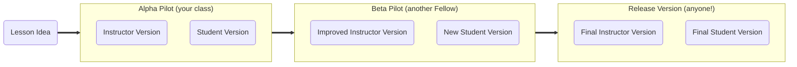
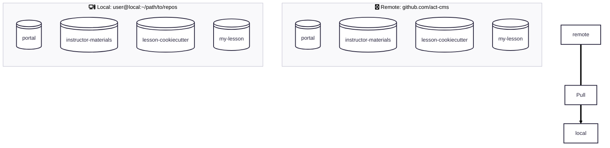

Chapter 1: The Big Picture
==========================

Welcome to the ACT-CMS community! In this chapter, you will be introduced
to the structure of the community and some big-picture ideas to guide your
efforts as a Faculty Fellow.

## Overview

Pedagogical development is challenging, and designing materials that prioritize
both cyberinfrastructure skill development and content instruction can feel
incredibly daunting. To support ACT-CMS Faculty Fellows through the process of
developing their open educational resources (OER), this cookiecutter was
developed to provide 
- A template for both a standalone lesson and a multi-part module,
- Demonstrations of several tools which facilitate lesson development and
deployment, 
- Collected advice for lesson design & development, and
- A step-by-step guide to the lesson development and contribution workflow
(called the _lesson flow_).

## 1.1 Lesson Development Life Cycle

For all ACT-CMS Fellows, there are generally three stages of lesson
development:

You should expect to complete this process by the end of your fellowship term,
however the actual timing of each step can vary depending on the frequency of
your own and other Fellows' course offerings etc. Each time your lesson is
taught, either by you in your own course or by another Fellow in theirs, it is
critical to improve the materials in response to the experience so that your
lesson is ready to be distributed to and adopted by other instructors in the
community. To help empower you to jump into the development of your proposed
lesson(s), we will explore each of the stages above in detail in this tutorial.

## 1.2 Tour of the ACT-CMS Organization

GitHub is a platform for file sharing and collaboration (kinda like Dropbox,
OneDrive, or Google Drive) but which was specifically developed for software
development. For now, imagining GitHub this way is sufficient; we'll get into
the nitty-gritty later. 

### 1.2.1 Version Control

Using version control, the complete history of a file over its lifetime can be
tracked, meaning that you can continue to work on a file and still return to
any point in its history without needing to create copies (e.g.,
`final-draft.docx` => `final2.docx` => `final-for-real-this-time.docx`).
Particularly for coding and other scientific tasks where incremental changes
are the norm and whose files are typically stored in a plain text format,
version control is an enormously powerful tool. The most popular and
wide-spread version control software is `git`, which can be used both via its
traditional command-line interface (CLI) and through the graphical user
interface (GUI) of the GitHub Desktop application (which will be referred to as
GHD below). Both `git` and GHD keep the history of all files in a _repository_
(just a fancy name for a file directory which has been placed under version
control) by tracking only the _changes_ to the files in the repository, meaning
that version control is also a lighter-weight strategy than keeping separate
copies around.  Before exploring the nitty-gritty of version control later in a
later chapter of these tutorials, let's first get familiar with the various
_locations_ where version control will be used.

### 1.2.2 Local & Remote Repositories

Whereas `git` and `GHD` can both be used to track changes within a repository
that lives on your own personal computer (referred to as _local_), what if
you want to collaborate with someone else? And what happens eventually when you
want to publish or distribute your work to the larger community? While Google
Drive, OneDrive, Dropbox, etc. could serve these needs, it sure would be great
to use a platform purpose-built upon the foundation of version control...

Fortunately there are several such platforms, including this one! GitHub is the
most widely used online hosting platform for repositories under version control
with `git`, and is the one used by ACT-CMS to host and distribute our open
educational resources. Local repositories can be pushed to GitHub to create a
_remote_ version, which can either be _public_ (visible to anyone online) or
_private_ (visible only to GitHub users approved by the repository owner). In
addition to individual users on GitHub, it is possible to have a GitHub
organization with several owners and other collaborators with varying levels of
access & permissions. The [`act-cms` GitHub
organization](https://github.com/act-cms) is one such example of this!

### 1.2.3 ACT-CMS Organization (`GH/act-cms`)

While there are many repositories owned by the ACT-CMS organization on GitHub
(abbreviated below as `GH/act-cms`), for your purposes as a Fellow you only really
need to be familiar with four:
1. [`GH/act-cms/portal`](https://github.com/act-cms/portal) 
    * Public repository housing the data which generates the
    [ACT-CMS Lesson Portal website](https://act-cms.molssi.org/portal/)
2. [`GH/act-cms/instructor-materials`](https://github.com/act-cms/instructor-materials)
    * Private repository for collecting instructor materials for developed lessons
    that are published/ready to publish on the Lesson Portal
3. [`GH/act-cms/lesson-cookiecutter`](https://github.com/act-cms/lesson-cookiecutter)
    * Private template repository that you will use to begin developing your own
    lesson/module
4. The many lessons/modules developed by Fellows as open educational resources, including
yours in the future!

In the next chapter, we will set up your `local` machine to mirror this
`remote` structure within `GH/act-cms`, visualized below:

## 1.3 Next Steps

Now that we have an idea of how the ACT-CMS organization is set up, let's set
up your `local` machine to mirror this structure and set up your local
environment for lesson development!

➡️ Next: [Chapter 2: Fellow Setup](02_fellow-setup.md)

