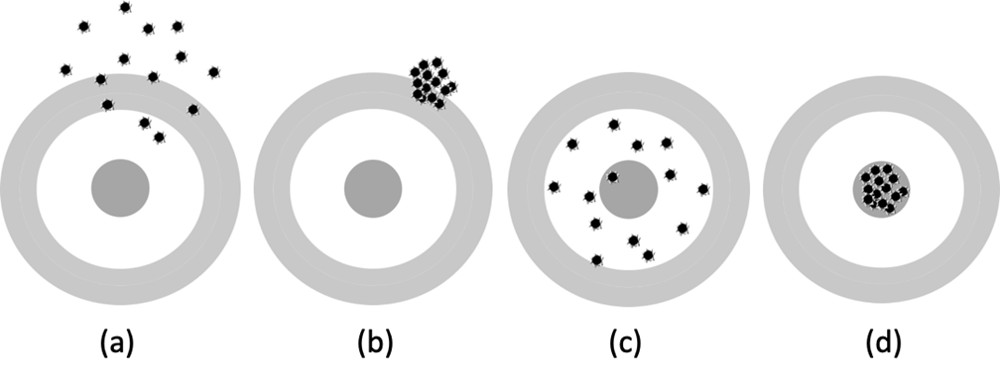
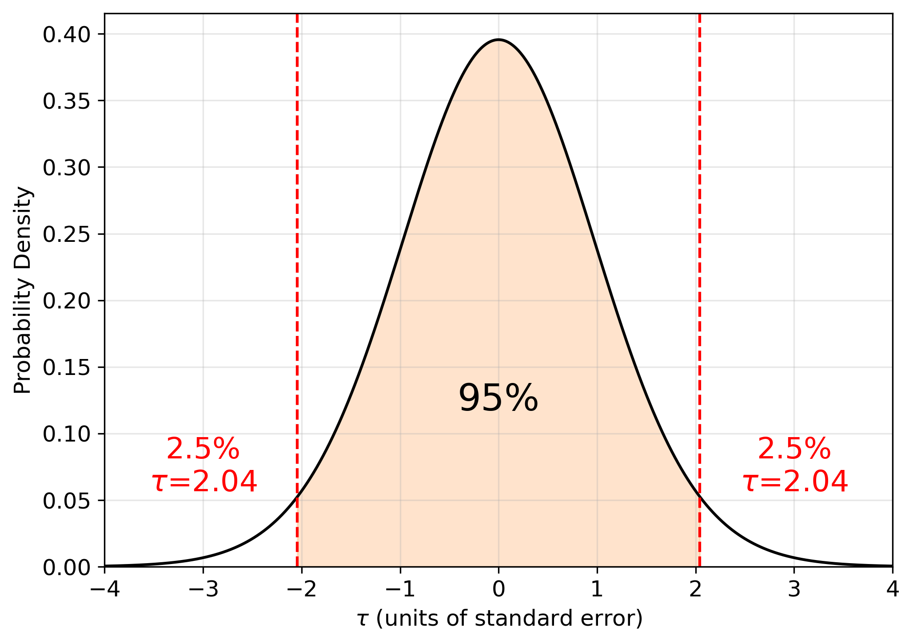
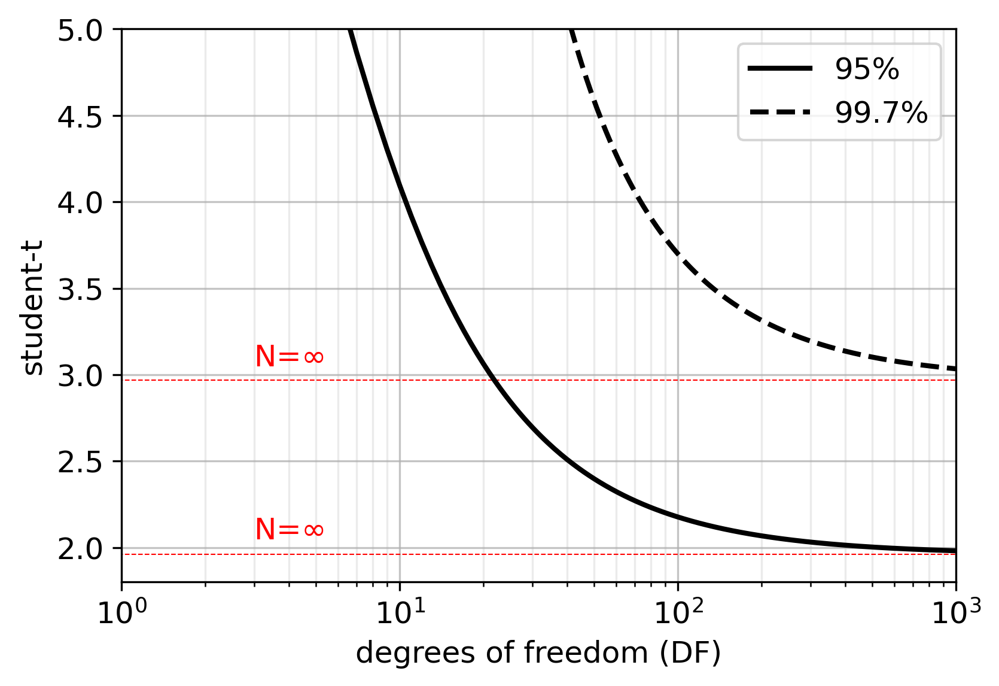
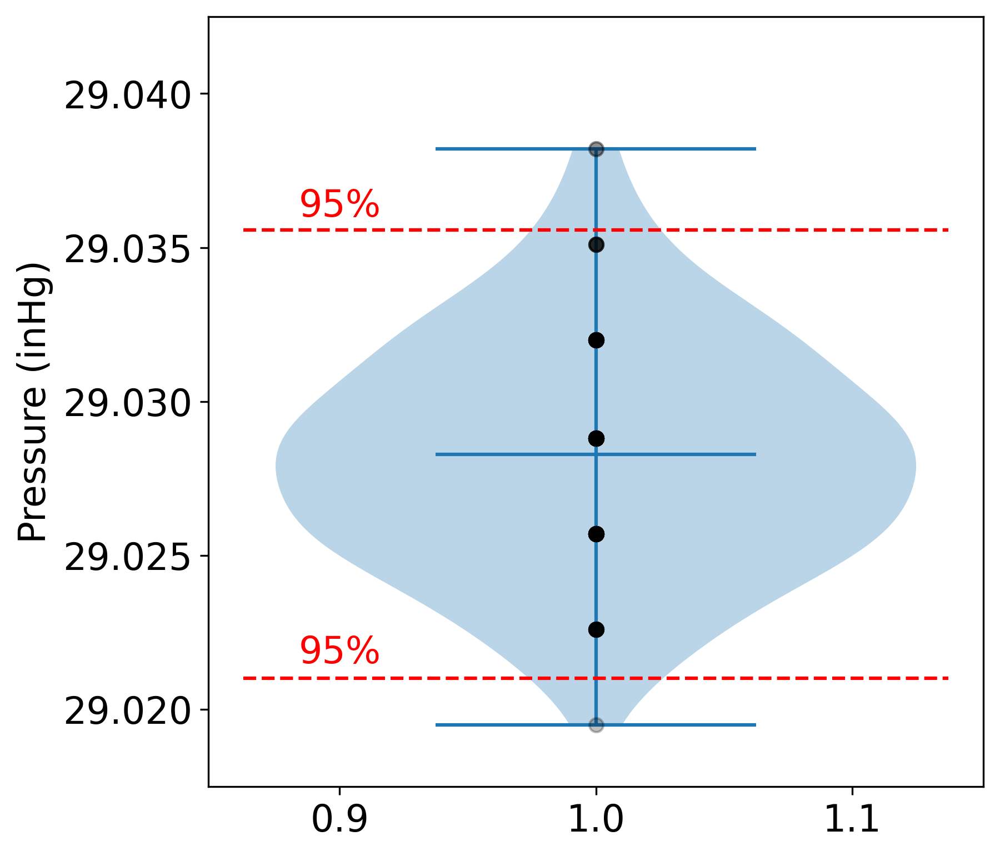
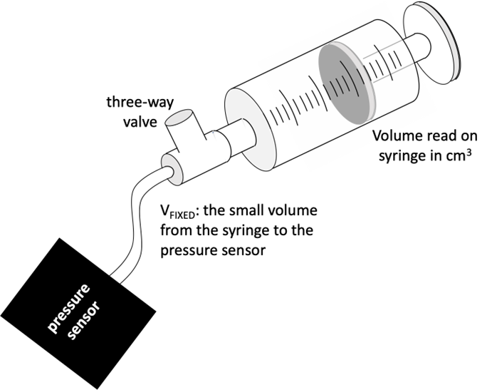
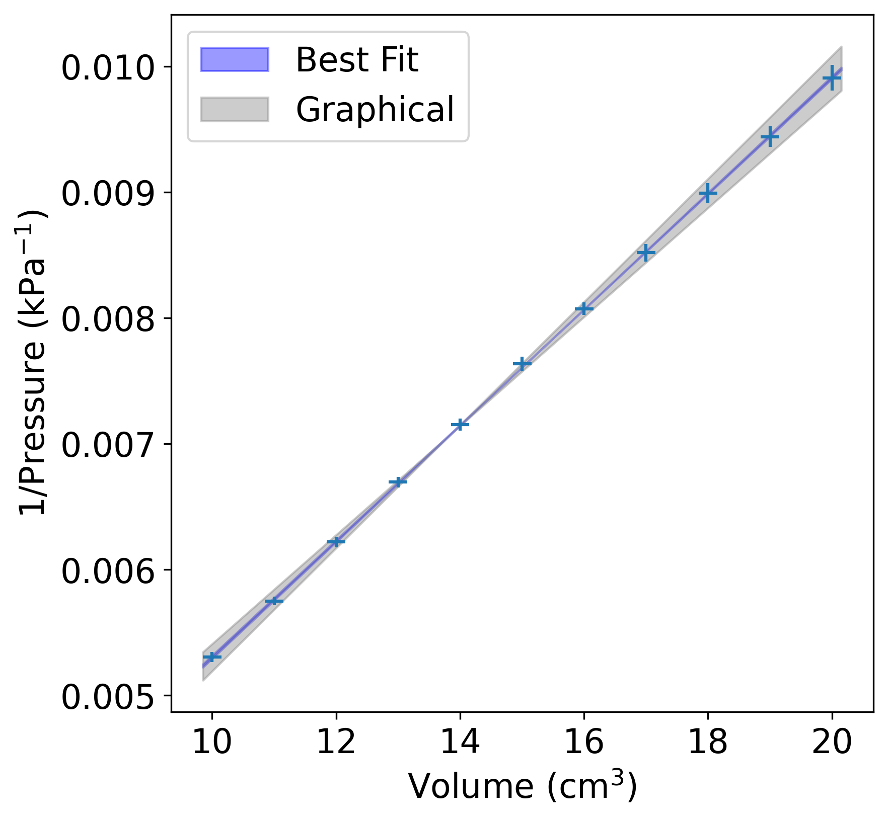
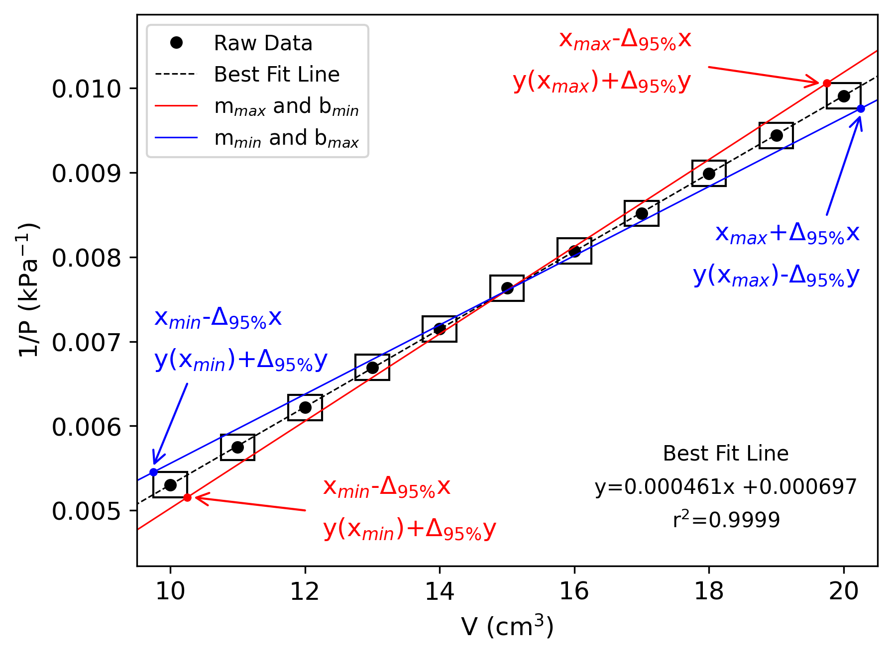

# TREATMENT OF EXPERIMENTAL DATA

> [!NOTE]
> Accuracy vs. Precision
> 
> Equation Fitting
> 
> Graphical Determination of Error
> 
> Propagation of Errors
> 
> Monte Carlo Sampling
> 
> Python for Scientific Data Analysis

Many experiments in physical chemistry involve quantitative measurements and their subsequent reduction and processing within the context of an established theory or accepted proportionality. Typically, the analysis of the results takes the form of mathematical fitting or graphical techniques to estimate atomic or molecular properties that are not themselves directly measurable (or not measurable by the tools available at the time). For example, the bond-length of the C=O bond in is not directly measurable at the University of Dallas, but by making measurements of the energies at which infrared energy is absorbed by , we can use those measurements to calculate its rotational constant from which we can estimate the moment of inertia and then estimate the C=O bond length (CHE 3332). "Estimation" is a key concept within the context of the treatment of experimental data because it implies that there is a finite precision that limits what can be known from the data. Understanding the precision of the measurements is critical in making decisions about the data and when using the data to make predictions outside of the range of physical measurements.

In this laboratory exercise, pressure will be measured under conditions of varying volume or temperature. The subsequent analysis will be within the context of Boyle's Law (constant temperature) 

$$
PV = constant
$$

 or Guy-Lussac's Law (constant volume) 

$$
\dfrac{P}{T} = constant
$$

The purpose of this laboratory exercise is not to re-establish Boyle's law or Guy-Lussac's Law. Rather, its purpose is to understand (a) how to identify random and systematic errors, and (b) how to propagate uncertainties in measurements through the analysis to understand the precision of the final result within the framework of well-established physical laws.

## Measurement Errors: Accuracy and Precision

All laboratory measurements are subject to errors. Measurement errors fall into two categories: systematic and random. It is helpful to think about systematic and random errors in the context of accuracy and precision. Referring to Figure [1.1](#Fig1-1-AccPrec), accuracy may be thought of as how well a set of measurements represents the actual property that it is intended to measure. In the analogy in Figure [1.1](#Fig1-1-AccPrec) bullets hitting the target, if there is a systematic mis-calibration of the targeting scope, then all shots will be systematically off target (Figure [1.1](#Fig1-1-AccPrec)b). In this analogy, systematic errors can be thought of as those errors which affect the accuracy of a measurement. Examples of systematic errors are mis-calibrated tools, the presence of unquantified impurities, leaks in apparatus, etc. Random errors arise from the inherent inability of instruments and human observers to function with absolutely reproducibly. Using again the analogy of the bullets hitting the target in Figure [1.1](#Fig1-1-AccPrec), the tightness of the grouping of bullet holes reflects the precision of the shooter which will depend on any number of hard-to-quantify things: steadiness of the aim, the range of masses of the bullet, etc. Precision of a measurement reflects the random errors inherent in the measurement. In all physical chemistry laboratory exercises, the goal to be accurate in our measurements (eliminating sources of systematic error) and to understand the inherent precision (unavoidable random errors) of both the measurements and resulting properties derived from them.

**1.1.** Accuracy and precision analogy: (a) not accurate and not precise, (b) not accurate but precise, (c) Accurate but not precise and (d) both precise and accurate.

In order to be able to make an estimate of the error in the final results of an experiment, we must make reasonable estimates of the **random** errors in all of the laboratory measurements. The magnitudes of the random errors depend on the **precision** of the instruments used. For example, a thermometer that has divisions of 1$\degree$ is less precise than one with 0.01$\degree$ divisions and will give rise to larger random errors. Similarly, a triple beam balance might have random errors on the order of 0.01 g, whereas an analytical balance might have 0.0005 g random errors.

> [!IMPORTANT]
> It is important to record in your notebook the precision of every experimental measurement.

The long-established convention is that measurement precision, **$\Delta_X$** follows the reporting of a measurement, $X$, as 

$$
X \pm \Delta_X \text{ units}
$$

Per the examples above, the mass of a sample on weighed on a triple beam balance would be reported as 14.32 $\pm$ 0.01 g (**always include units**). If an analytical balance is used, the mass would be reported as 14.3218 $\pm$ 0.0005 g. Generally, the $\pm\Delta_X$ can be easily determined from the size of the divisions on an analog instrument scale, such as on a thermometer, or from the number of digits on a digital instrument. We are assuming that the absolute precision of these instruments is within these estimates of the random errors.

A good rule of thumb for estimating the error in measurement from instrument which requires a human to read the measurement from a calibrated device (a ruler or mercury thermometer), for example) is to use the smallest **marked** division of the measurement tool as the smallest **known** digit. You may estimate the next decimal place which will be subject to uncertainty. Some human judgment is needed in determining the uncertain digits and level of uncertainty (one or two tenths of the scale division, typically[^1]). For example, the plastic syringe used in the Boyle's Law experiment is marked at 1 intervals from 0 to 23 . It is reasonable that the volume can be read to the known nearest 1 , with an uncertainty of $\pm$0.1 . Therefore, reading from this measuring instrument would have the form 

$$
20.0\pm 0.1 \text{ cm}^3
$$

 Many modern measurement tools give digital readouts where the number of significant digits reported ****MAY** not be the same as the measurement uncertainty**. Always consult the tool's operation manual to understand the measurement uncertainty. If documentation is not available for a digital tool, the uncertainty should be conservatively be estimated as a 5 in the last reported decimal place. For example: If you read a value from a digital balance as 52.368 g, then the error would be $\pm$0.005.

Another way to get the measurement uncertainty is to make multiple repeated measurements then calculate a sample variation and the 95% confidence limits. Sample variance, $s$, is an estimation of the standard deviation, $\sigma$. As the number of measurements ($N$) increases, $s$ becomes a better estimation of $\sigma$. As $N\rightarrow\infty$, $s\rightarrow\sigma$.

Going forward, we will consider the 95% confidence limits to be a reasonable estimation of the measurement uncertainty. The 95% confidence limits, $\Delta_{95}X$, for a measurable quantity, $X$, is 

$$
\Delta_{95}X = s_X \times t_{95}
$$

 $s_x$ is the sample variation of the measurements of $X$.[^2] $t_{95}$ is the value of the so-called "Student t-distribution"[^3] dependent on the confidence level (95% or 0.95) and the number of degrees of freedom (DF). Random errors are distributed in a Gaussian or Normal distribution. The student-t factor is given as 

$$
\int_{-t_{x}}^{t_{x}} P(\tau)d\tau = x()
$$

 The probability function $P(\tau)$ is a normalized function which is dependent on the degrees of freedom (i.e., the number of measurements and the number of derived results). The integral in Equation [1.4](#Eq1-4-Prob) is illustrated in Figure [1.2](#Fig1-2-GaussProb).

**1.2.** The Gaussian probability density function for DF=30 and the 95% confidence limits.

We can begin to understand this equation by considering what we know about the mean ($\mu$) and standard deviation ($\sigma$) of a distribution that follows Gaussian statistics. 99.7% of the distribution is contained in the range $\mu\pm 3\sigma$. This statement is equivalent to Equation [1.5](#Eq1-5-GaussInt). 

$$
\int_{-3}^{3} P(\tau)d\tau=0.997
$$

**1.3.** The dependence on t99.7% and t95% on degrees of freedom.

In this case, $t_{99.7}$ is 3, but this has one very important caveat: Equation [1.5](#Eq1-5-GaussInt) assumes a very large number of degrees of freedom (i.e., a large number of measurements). Effectively, we can only use Equation [1.5](#Eq1-5-GaussInt) in the case of $N$ greater than roughly 1000 measurements. For $N$ less than 1000, the $t_{99.7}$ increases with decreasing degrees of freedom. For $N$ measurements from which one property is derived (mean or standard deviation for examples), one degree of freedom (DF) is reserved for the derived property, leaving $N$-1 degrees of freedom to statistically assess the distribution: DF=$N$-1 in this case. For smaller sample sizes, we have to go beyond $\mu\pm 3\sigma$ to be 99.7% confident in the distribution. This is illustrated in Figure [1.3](#Fig1-3-Tdist) for the 99.7% and 95% confidence levels.

In Python, a built-in function from the scipy.stats package called **scipy.stats.t** calculates the student-t value where the user provides the probability and DF. Example [Prop1-1:TtestPython](#Prop1-1-TtestPython) shows the syntax.

Probability is "1 MINUS confidence". So, for the example given in Figure [1.2](#Fig1-2-GaussProb), confidence is 95% and DF=30. 1-confidence is 0.05 and **tinv**(0.05,30)=2.04. By dividing the probability $p$ by 2, these functions return the standard two-tailed value of the student-t distribution. In the case of the 95th percentile, the two-tailed integral excludes the part of the tail on either side that is 2.5% (or $p$/2), effectively excluding the outermost 5% of the distribution (See Figure [1.2](#Fig1-2-GaussProb)).

As an example, we may find the measurement uncertainty for a Vernier Barometer (BAR-BTA) by taking a large number of readings under constant pressure conditions, determining the sample variation, and calculating $\Delta_{95}p$ from Equation [1.3](#Eq1-3-Uncertainty). Figure [1.4](#Fig1-4-PressureData) shows pressure measurements taken at 10 second intervals to generate a data set of 110 measurements in units of inHg, reported to the 4th decimal place. For this data set:

$$
\begin{align*}
\text{(Mean) } \bar{X} &= 29.0283 \text{ inHg}\\
\text{(Sample Variance) } s_X &= 0.0037 \text{ inHg}\\
DF &= N-1 = 110-1 = 109\\  
\end{align*}
$$

For 95% confidence, **tinv**(0.05, 109) comes out to be 1.982. Thus, using Equation [1.3](#Eq1-3-Uncertainty), $\Delta_{95}p$ is 0.0037$\times$1.982 = 0.0073. However, in this analysis we will round $\Delta_{95}p$ to one significant figure, and make that digit the uncertain digit in the reported mean. Based on this exercise, the mean is reported as

29.028 $\pm$ 0.007 inHg

**1.4.** A violin plot of the pressure data used to determine the precision of the Vernier Barometer. The data indicate pMEAN is 29.028 inHg and Δ95%p is 0.007 inHg. The black dots are the measured data points. The red dashed lines represent the 95% confidence interval. The blue filled-in curves represent the kernel density of the distribution the data points.

**Systematic errors** are not easily quantified and may, in fact, only be identified with hindsight. The best way to avoid introducing systematic errors is to follow a few basic guidelines:

1.  Carefully inspect your experimental set-up, making sure all set-up instructions are followed exactly.

2.  Follow all procedural steps exactly as written.

3.  Be consistent in data collection from one experimental run to the next.

4.  Finish all data collection in one sitting. Doing half of the measurements on one day, and the other half the next day may introduce an unintended systematic error in your overall dataset.

5.  Double-check calculations and values of physical constants used in data analysis.

**1.5.** The experimental set-up for the Boyle’s Law experiment.

It is always prudent to compare your ultimate results to accepted literature values. Deviations outside the range of propagated random errors may indicate the presence of a systematic error in either your procedure or data reduction. For all PChem formal lab reports, you will be asked to do this and identify potential sources of systematic error. For example, in the Boyle's Law experiment, volume is read on a graduated syringe and pressure is measured on a pressure sensor as the syringe plunger is depressed in the set-up shown in Figure [1.5](#Fig1-5-Apparatus). A plot of the reciprocal of the pressure (1/$p$) versus the volume gives a straight line per the expectations from the ideal gas law. However, you find that, contrary to the expectations from the ideal gas law, your plot shows a non-zero reciprocal pressure (non-infinite pressure) at zero volume ($V\rightarrow$0, 1/$p$ $\rightarrow$0 and p $\rightarrow\infty$), as seen in Figure [1.6](#Fig1-6-BoyleLaw).

Systematic errors may creep into the procedure due to mis-calibration or a failure to account for all variables. You might consider the pressure sensor calibration. If there was a systematic offset in the pressure readings, could that be enough to shift the 1/$p$ vs. $V$ curve up, resulting in a non-zero intercept? If there is a leaky seal on the syringe, then as the volume is decreased and pressure increases then the number of moles will decrease making the apparent pressure lower. Could this potentially explain the offset seen in the plot of the raw data in Figure [1.6](#Fig1-6-BoyleLaw)? These potential sources of systematic error could be investigated with a carefully designed follow-up experiment.

Another possible systematic error to consider is a missing variable or condition. Consider again the set-up shown in Figure [1.5](#Fig1-5-Apparatus). The actual volume of gas being measured is the volume read of the syringe PLUS the small volume of the tube and three-way valve connecting the syringe to the pressure sensor, $V_\text{fixed}$. The positive intercept, or a non-infinite pressure as $V\rightarrow0$ indicates a positive volume "offset" somewhere ($V_\text{fixed}$). This seems to be the likeliest source of the systematic error. $V_\text{fixed}$ will be determined from your data (see Procedure section) along with an estimation of its error.

## Equation Fitting

Often we know, or suspect, that our data should obey some functional form. In the case of an ideal gas, for example, we would expect that a plot of pressure vs. temperature with volume held constant should be a straight line since 

$$
p=\dfrac{nR}{V}T
$$

 with $T$ being the absolute temperature in Kelvin. The equation for a straight line is 

$$
y = mx + b
$$

 where $m$ represents the slope of the line and $b$ the y-intercept (the intersection of the line with the y-axis **at x = 0**). Therefore, our graph of $p$ vs. $T$ for an ideal gas should have slope, $m$, equal to 

$$
\dfrac{nR}{V}
$$

 and intercept, $b$, equal to 0 K.

**1.6.** Boyle’s Law plot showing the intercept offset from Vfixed.

Based on the Ideal Gas Law, Equation [Eq1-X:IdealGasLaw](#Eq1-X-IdealGasLaw), a plot of $p$ vs. $V$ at constant volume would not be expected to be a straight line. However, a plot of 1/$p$ vs. $V$ (Figure [1.6](#Fig1-6-BoyleLaw)) should give a straight line with slope equal to 1/$nRT$ and zero intercept. The \"best\" straight line through any set of data points can be determined using a technique known as *regression analysis* or *linear least squares*. The method uses calculus to find the optimal straight line by minimizing the squares of the deviations of the data points from the line.[^4] The resulting equations for $m$ and $b$ are

$$
\begin{align}
m&=\dfrac{n\sum x_iy_i -\sum x_i \sum y_i}{\Delta} \\
b&=\dfrac{n\sum y_i\sum x_i^2 -\sum x_i \sum x_iy_i }{\Delta} \\
\Delta&=n\sum x_i^2-\big(\sum x_i\big)^2 \end{align}
$$

Equations [1.6](#Eq1-6-Slope), [1.7](#Eq1-7-Intecept), and [1.8](#Eq1-8-Delta) are coded into Excel as **SLOPE**(y-values, x-values) and **INTERCEPT**(y-values, x-values). From an error analysis point of view, it is better to use the array function **LINEST**(y-values, x-values, BOOLEAN1, BOOLEAN2) if using Excel (See Appendix [G](#AppG-Excel)).

While Python can be used to recreate the Excel **LINEST** array function by defining a custom function that outputs the same information, it is less work to use the **scipy.stats.linregress** package to get the data for a best fit linear line. Note that the variables x, y, and best_fit can be arbitrarily named.

## Graphical Determination of Error

Equation fitting, LINEST analysis, and scipy.stats.linregress will give standard errors, from which 95% confidence limits may be calculated by the methods outline above. These methods give standard errors dependent on the scatter of the data points and do not fold into the analysis any uncertainty in measurement. A rough (and conservative) estimate on the expected uncertainty in slope and intercept from a straight-line fitting of the data can be graphically as follows.

A simple way to estimate uncertainty from a graph is to draw an \"error box\" around each data point $(x_i, y_i)$. This box is centered on the point and has a width of $\Delta_{95}x$ and a height of $\Delta_{95}y$ (Figure [1.7](#Fig1-7-SlopeIntercept)). The idea is that the true value of the point is likely somewhere inside the box, while values outside the box are unlikely to be correct. [^5] The key two points for the graphical determination of error are the two extreme data points: 

$$
(x_\text{max},y(x_\text{max})) \text{ and } (x_\text{min},y(x_\text{min}))
$$

 Two lines are estimated from these two extreme data points as follows:

1.  Maximum slope and minimum intercept is defined by the slope and intercept from the following two points (red):

    x                                      y
      ------------------------------- ---------------------------------------------
       $x_\text{max}-\Delta_{95}x$   $y\left(x_\text{max}\right)+\Delta_{95}y$
       $x_\text{min}+\Delta_{95}x$   $y\left(x_\text{min}\right)-\Delta_{95}y$

2.  Minimum slope and maximum intercept is defined by the slope and intercept from the following two points (blue):

    x                                      y
      ------------------------------- ---------------------------------------------
       $x_\text{max}+\Delta_{95}x$   $y\left(x_\text{max}\right)-\Delta_{95}y$
       $x_\text{min}-\Delta_{95}x$   $y\left(x_\text{min}\right)+\Delta_{95}y$

**1.7.** Graphical determination of the error in slope and intercept. The error boxes are exaggerated to illustrate the technique.

For the data used to generate Figure [1.6](#Fig1-6-BoyleLaw), $\Delta_{95}V$ is 0.1 and $\Delta_{95}(1/p)$ ranged from 1.03 × 10^−4^ to 3.36 × 10^−5^ kPa$^{-1}$. Using these two sets of ordered pairs, two limiting best fit lines are generated. The difference between the two slopes or intercepts can be taken as the 95% confidence interval ($\Delta_{95}$) of the slope and intercept of the best fit line. In the final report, uncertainties from the scipy.stats.linregress output and the graphical method need to be reported as in Table [1.5](#Tab1-5-Results). The graphical method is a crude and conservative estimation of the confidence limits when uncertainty in measurement is considered. Monte Carlo methods offer a better way to fold in the uncertainty in measurements into the overall estimate on uncertainty in slope and intercept.

| Method        | $m \pm \Delta_{95}m$ (kPa $^{-1}$ cm $^{-3}$) | $b \pm \Delta_{95}b$ (cm $^{3}$) |
|--------------|---------------------------------------------|----------------------------------|
| Best Fit     | (4.61 $\pm$ 0.02)·10 $^{-4}$                  | (6.97 $\pm$ 0.36)·10 $^{-4}$      |
| Monte Carlo  | (4.61 $\pm$ 0.23)·10 $^{-4}$                  | (6.97 $\pm$ 3.28)·10 $^{-4}$      |
| Graphical    | (4.61 $\pm$ 0.30)·10 $^{-4}$                  | (6.97 $\pm$ 4.21)·10 $^{-4}$      |

  : Reported of error in slope and intercept

## Monte Carlo Methods

> [!NOTE]
> Monte Carlo techniques involve the solution of problems through the computation of random numbers and their incorporation into the construction of simulation models of physical systems or the computation of characteristics of those systems.[^6]

Monte Carlo sampling is a repeated random sampling technique to obtain numerical results named after the famous European gambling city. These methods are especially useful for solving problems that are difficult or impossible to address analytically, such as evaluating multi-dimensional integrals, modeling uncertainty, or simulating physical systems with complex behavior. By generating a large number of random inputs, Monte Carlo simulations can be used to approximate outcomes, calculate probabilities, or explore the statistical properties of a system. In PChem research, Monte Carlo techniques are frequently used to explore thermodynamic ensembles of molecules, whether in the gas phase or in solution, to predict thermodynamic and kinetic behavior. For instance:

- **Kinetic Monte Carlo (kMC)** helps simulate the time evolution of reaction networks to understand kinetic pathways.

- **Grand Canonical Monte Carlo (GCMC)** provides a rigorous molecular-level framework for modeling adsorption and is often used to study small-molecule uptake in porous materials.

In this lab, we are utilizing Monte Carlo sampling to estimate best-fit lines for experimental data, accounting for uncertainties in the measurements. This sampling technique will be used alongside equation fitting and graphical determination of error to analyze the treatment of experimental data. Python can take numerical and statistical analysis to larger data sets with more ease than Excel. Therefore, we will generate up to 1 × 10^5^ best fit lines through a normal distribution of random displacements to the mean, i.e., data within the \"error box\". Appendix [D](#AppD-MonteCarlo) has a more detailed explanation of Monte Carlo methods and how it can be used to analyze experimental data.

**1.11.** 1000 random xi, random yi points following a (a) normal and (b) uniform distribution.

In Figure [1.11](#Fig1-11-MonteCarlo)a, 1000 data points are randomly generated but are centered around the mean and are normally distributed. The red box indicates the standard error (or 1 standard deviation from the norm), whereas the purple box indicates the $\Delta_{95}$. Based on how the points are spread, we need to consider a normal distribution since this is a better representation of how our data will look compared to the uniform distribution. Also, in the uniform distribution, all the points lie within the 95% confidence interval, which defeats the purpose of calling this a 95% confidence interval.

**1.8.** A plot of 1 × 106 randomly generated slope-intercept combinations from Monte Carlo sampling (green) and best fit lines using randomly selected measurements (blue). The Δ95% boxes for each error assessment method are shown. Full info in Appendix [AppD:MonteCarlo].

In Figure [1.8](#Fig1-8-MonteCarlo), the black dot represents the best fit line generated through the scipy.stats.linregress method in Python and the equivalent LINEST function in Excel, and the respective dashed box represents the data points captured by the $\Delta_{95}$ of the slope and intercept with this method. The blue data points are best fit slopes and intercepts generated through a Monte Carlo sampling of a normal distribution centered around the mean of each data point. The darker blue dashed box shows the $\Delta_{95}$ generated through the Monte Carlo method (note how the box does not cover all the data points in agreement with the normal distribution). The average and standard error of the Monte Carlo box was generated by calculating the average of all the slopes and intercepts excluding the standard error associated with each slope/intercept that is generated. This is because Monte Carlo embeds the uncertainty into the distribution of the resulting slopes and intercepts. This reflects the propagated effect of the original uncertainty. Finally, the light blue dashed box shows the predicted error using the graphical error method outlined in the previous section.

The density plots shown above both axes show how the data points are distributed along both axes. The green line shows the distribution of Monte Carlo data points. Note how the distributions resemble a normal distribution as both of them follow the central limit theorem from probability statistics (taking a sufficiently large sample from the population yields a normal distribution).

## Propagation of Errors

In a typical physical chemistry experiment, measurements are made in lab which are then used to calculate resultant properties. The estimated errors in measured quantities or error estimates from graphs are used determine an estimate of the error in the calculated result. The technique for doing this is known as *propagation of errors*. The general recipes for the propagation of errors, assuming completely independent variables, are below.[^7] Consider $Z$, that is a function of $x$ and $y$: $Z=f(x, y)$. The variables $x$ and $y$ each have uncertainties: $x \pm \Delta_x$ and $y \pm \Delta_y$ . $Z$ has an uncertainty, $\Delta_Z$ that is related to $\Delta_x$ and $\Delta_y$ as

$$
\Delta_Z^2=\Delta_x^2 \bigg(\dfrac{\partial Z}{\partial x}\bigg)^2+\Delta_y^2 \bigg(\dfrac{\partial Z}{\partial y}\bigg)^2
$$

Here are some common applications of Equation [1.15](#Eq1-15-Uncertainty). 

$$
\begin{align}
Z=\textbf{a}x\pm \textbf{b}y && \Delta_Z^2=\textbf{a}^2\Delta_x^2+\textbf{b}^2\Delta_y^2 \\
Z=\textbf{a}xy \text{ or } Z=\textbf{a}x/y && \dfrac{\Delta_Z^2}{Z^2} =\dfrac{\Delta_x^2}{x^2}+\dfrac{\Delta_y^2}{y^2} \\
Z=x^{\pm \textbf{a}} && \dfrac{\Delta_Z}{Z}= \pm \textbf{a}\dfrac{\Delta_x}{x} \\
Z=e^{\pm \textbf{a}x} && \dfrac{\Delta_Z}{Z}= \pm \textbf{a}\Delta_x \\
Z=a^{\pm \textbf{b}x} && \dfrac{\Delta_Z}{Z} = \pm (\textbf{b}\text{ ln }\textbf{a}) \Delta_x \\
Z=\textbf{a} ln(\pm \textbf{b}x) && \dfrac{\Delta_Z}{Z}= \textbf{a} \dfrac{\Delta_x}{x} \end{align}
$$

Consider, for example, a calculation of heat capacity, $C$, from a measurement of heat released, $q$, divided by the change in temperature, $\Delta T$, 

$$
C=\dfrac{q}{T_2-T_1} = \dfrac{q}{\Delta T}
$$

 Assume $\Delta_q$ is the error in $q$ and $\Delta T$ is the error in each temperature, $T_2$ and $T_1$. To calculate $C$, we have to take the problem in two steps. Step one is to calculate the uncertainty in the denominator $T_2$-$T_1$, $T$ using Equation [1.16](#Eq1-16-Unc-add).

$$
{\Delta T}^2={T_1}^2+{T_2}^2
$$

Since ${T_1}={T_2}$, we can call them both a generic $\Delta T$ then Equation [1.22](#Eq1-22-Error-Temp) simplifies to

$$
\Delta T^2=2 T^2 \text{ and } \Delta T = \sqrt{2} T
$$

Now move on to Equation [1.17](#Eq1-17-Unc-mult) to find $C$. 

$$
\dfrac{\Delta_C^2}{C^2} =\dfrac{\Delta_q^2}{q^2} +\dfrac{\Delta_{\Delta T}^2}{\Delta T^2}
$$

$$
\Delta C=C\times\sqrt{\bigg(\dfrac{\Delta_q}{q}\bigg)^2 +\bigg(\dfrac{\Delta_{\Delta T}}{\Delta T}\bigg)^2}
$$

If $C$ = 2123 J/K, $q$ = 6581 $\pm$ 10 J, and $\Delta T$ = 3.1 $\pm$ 0.14 K ($T$ = 0.1 K), then

$$
\begin{align*}
\Delta C&=2123 \dfrac{J}{K}\times\sqrt{\bigg(\dfrac{10}{6581}\bigg)^2+\bigg(\dfrac{0.14}{3.1}\bigg)^2}\\
\Delta C&=2123 \dfrac{J}{K}\times\sqrt{2.31E-6+0.0204}\\
\Delta C&=2123 \dfrac{J}{K}\times\sqrt{0.0204}\\
\Delta C&=96 \dfrac{J}{K}
\end{align*}
$$

Note that from a significant figures point of view, $\Delta C$ must have the same precision as $C$. Note also how this analysis helps identify the biggest source of error in the experimental determination of $C$. The contribution of errors in the q value is much smaller than the error due to the temperature measurement. Therefore, **the most significant improvement to the experiment would be to use a more precise thermometer**. Without a more precise thermometer there is not any benefit in measuring $q$ more precisely.

### Discussion Questions

1.  Discuss how your results compare with your expectations relative to the ideal gas law and therefore the fitness of the experimental conditions with respect to expectations that the ideal gas law is the best fit to the data. If your results are not reasonable, offer suggestions as to why. The next best approximation would be to the van der Waals equation. Does the precision of the measurements permit a determination of whether the ideal gas law or the van der Waals equation is a better fit to the data? Cite references for any physical constants you need for this discussion.

2.  Discuss the sources of error and indicate the largest source of error in the experiment.

3.  Discuss how the $\Delta_{95}p$ calculated in STEP 2 compares to the $\Delta_{95}p$ calculated for each pressure measurement in STEP 4. Is it a safe assumption to use the $\Delta_{95}p$ from STEP 2 as the $\Delta_{95}p$ for all measurements made in STEP 4?

4.  Compare and contrast the errors calculated via equation fitting (linregress), graphical error determination, and Monte Carlo sampling techniques. How well do you think each method estimates the error in a physical sense?

5.  Does your calculation of $V_\text{fixed}$ make sense relative to a rough estimation using length measurements ($V_\text{fixed} \approx$ 1.47 )?

6.  What do you think the Monte Carlo data is showing in terms of modeling uncertainty? What are the statistics for the predicted $V_\text{fixed}$ using the Monte Carlo generated slopes and intercepts? (Question 3 in Jupyter Notebook)

### References

[^1]: David P. Shoemaker, Carl W. Garland, and Joseph W. Nibbler, Experiments in Physical Chemistry, 5th Ed. (New York: McGraw-Hill, 1989), 30.

[^2]: The sample variation is calculated in EXCEL using the function STDEV which has the same functional given in …Douglas A. Skoog, Donald M. West, F. James Holler, and Stanley R. Crouch, Fundamentals of Analytical Chemistry, 8th Ed. (Belmont, CA: Brooks/Cole, Cengage Learning, 2004), 115.

[^3]: Shoemaker, Garland, and Nibbler, Experiments in Physical Chemistry, 45.

[^4]: Philip R. Bevington and D Keith Robinson, Data Reduction and Error Analysis for the Physical Sciences, 2nd ed. (New York: McGraw-Hill, 1992), 53-62.

[^5]: Garland, Nibler, Shoemaker; Experiments in Physical Chemistry 7th ed., 36-37.

[^6]: Najarian, John P. Najaian, "Monte Carlo Techniques," Salem Press Encyclopedia of Science, 2019

[^7]: Bevington, 43-50.
