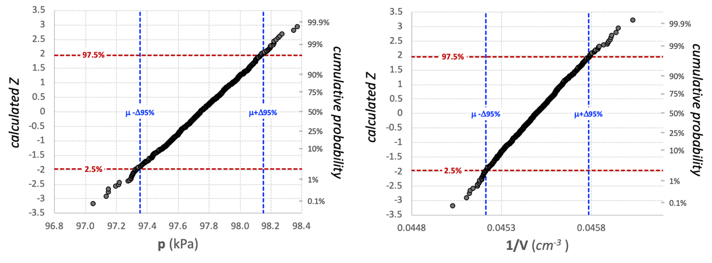
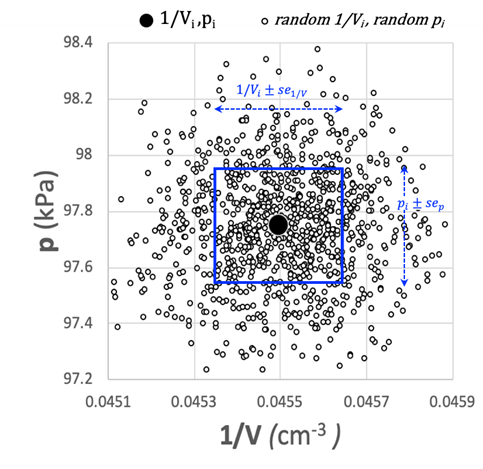
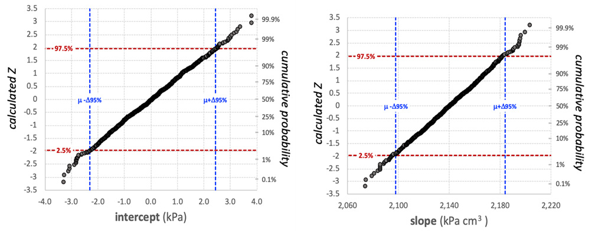
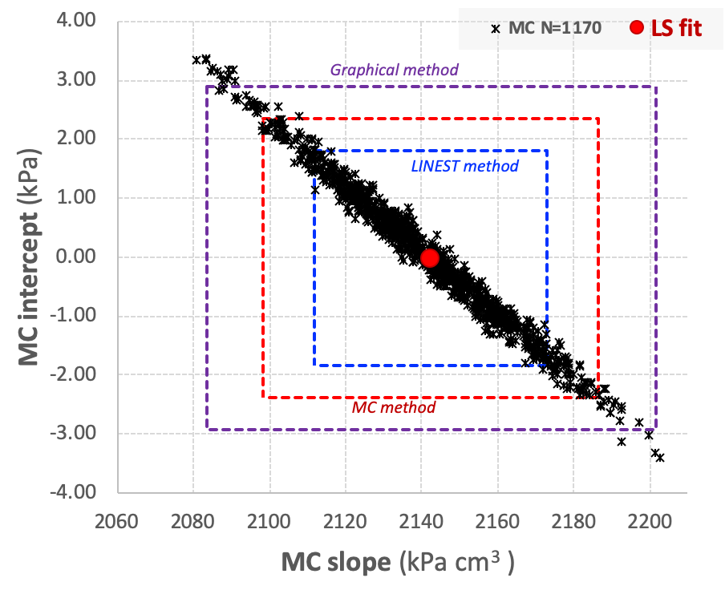
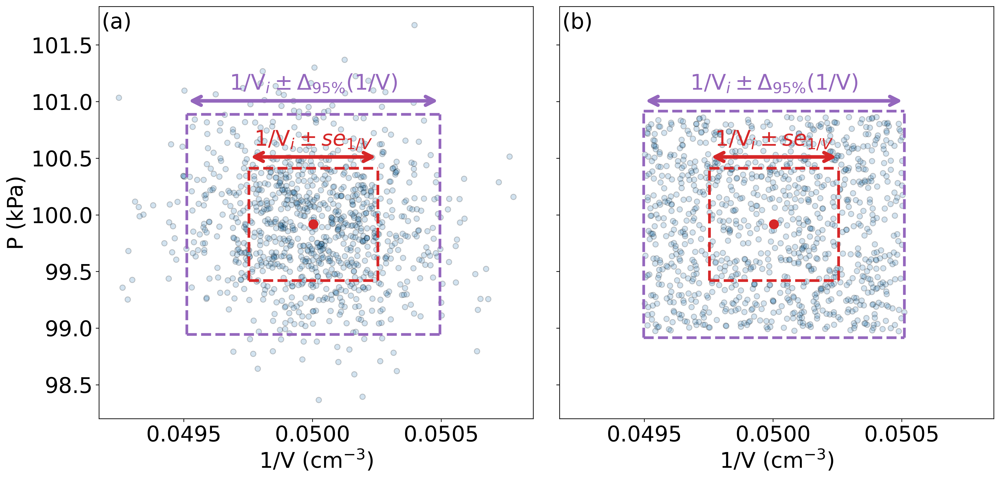
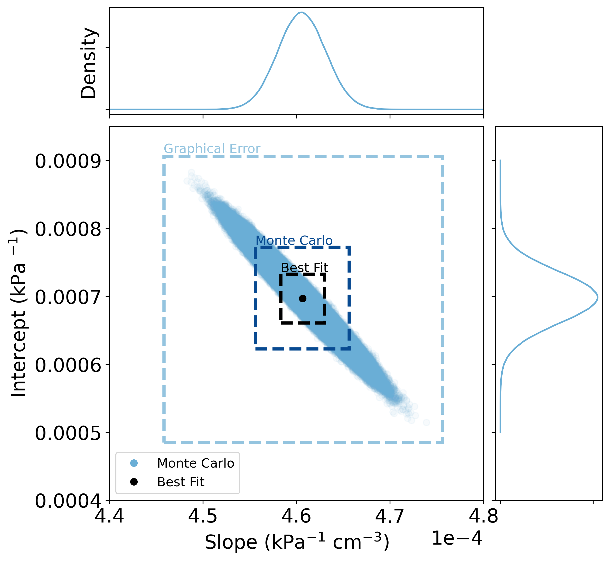

# MONTE CARLO METHODS

> [!NOTE]
> Monte Carlo techniques involve the solution of problems through the computation of random numbers and their incorporation into the construction of simulation models of physical systems or the computation of characteristics of those systems.[^1]

## Microsoft Excel

r0.6 {width="60%"}

Excel is a very powerful tool for statistical analysis seen in previous courses and to an extent, Lab [1](#Lab1-ExpData). The statistical Excel functions that characterize the errors in slope and intercept in the linear regression analysis do not incorporate measurement error into the assessment. For this reason, we used a conservative graphical method to estimate error in slope and intercept.

The graphical method brackets the data within $\pm$ 1 $\sigma$ in both x- and y-coordinates around the two extreme points of the data to determine the maximum and minimum slope and intercept (see Figure [FigD1:Plot](#FigD1-Plot)) This is a conservative way to determine the uncertainties since 63.8% of the distribution of points falls less than $\pm$ 1$\sigma$ deviation from the measured data in both the x- and y-dimensions. Thus, roughly 40.7% (63.8%$\times$ 63.8%) of these random points fall inside the $\pm$ 1 $\sigma$ box and are not considered in the graphical method. To improve our estimate of error in slope and intercept, we need to generate a realistic, random distribution in the x- and y-coordinates around each point in the line, take a new slope and intercept, repeat the procedure a great many times, then analyze the distribution of slopes and intercepts to determine more realistic uncertainties. This is the Monte Carlo Method.

----------- ---------------------- ------- ------------------
      1/V      $\Delta_{95}(1/V)$     p     $\Delta_{95}p$
   cm$^{-3}$         m$^{-3}$          kPa          kPa
    0.0455            0.0003          97.8          0.4
    0.0477            0.0003          102.3         0.4
    0.0501            0.0004          107.4         0.4
    0.0527            0.0004          113.1         0.4
    0.0556            0.0004          118.9         0.4
    0.0589            0.0005          125.6         0.4
    0.0626            0.0006          134.0         0.4
    0.0668            0.0006          142.3         0.4
    0.0715            0.0007          153.6         0.4
    0.0770            0.0008          165.6         0.4
  ----------- ---------------------- ------- ------------------

  : p vs 1/V data

Excel has a built-in random number generator, **RAND()**, that generates random numbers evenly distributed between 0 and 1 (0$\leq$**RAND()**$\leq$1). Excel 2010 and later revisions use the Mersenne Twister algorithm (MT19937[^2]) to generate the random numbers with **RAND()**.[^3] However, random errors are not distributed evenly around a data point, they are distributed according to a Normal Distribution (a.k.a. Gaussian Distribution).

To generate a random Normal distribution, we can use **RAND()** to generate a cumulative probability between 0 and 1, then use Excel's built-in function **NORM.INV(cumulative probability, $\mu$, $\sigma$)** to generate a hypothetical, possible value of a measurement given its measurement uncertainty. Here $\mu$ is the mean of the distribution and $\sigma$ is the standard deviation, or the variability within a single sample. In the case of the point $x_i$, $y_i$ (i=1,2,3, $\ldots$, 10 in Table [TabD1:Data](#TabD1-Data)), we can generate a new random point within the restrictions of the known uncertainty ($\sigma\approxeq\Delta_{95}$/2) as 

$$
\begin{align}
\text{random } x_i &= \text{NORM.INV}(\text{RAND}(),x_i,\sigma_x)\\
\text{random } y_i &= \text{NORM.INV}(\text{RAND}(),y_i,\sigma_y)\end{align}
$$

 To test whether or not a normal distribution was created with this method, a normal probability plot is needed. A normal probability plot is a useful analytical tool for graphically determining the normalcy of a distribution of data and to tell at a glance if outliers are present. This graphical tool plots a calculated Z-score, given by Equation [EqD3:Z](#EqD3-Z), against an ordered (or sorted) dataset. The Z-score is the number of standard deviations a data point is from the mean. 

$$
Z_i=\dfrac{(x_i-\mu)}{\sigma}
$$

 To create a normal probability plot, the data first needs to be sorted smallest-to-largest. Next, a cumulative probability, $p_i$, for each ordered $x_i$ is created using Equation [EqD4:prob](#EqD4-prob).[^4] 

$$
p_i = \left\{
\begin{array}{ll}
1-p_N & i = 1 \\
\dfrac{(i-0.3175)}{(N+0.365)}& i = 2,3,\ldots,N-1 \\
0.5^{1/N} & i=N
\end{array}
\right\}
$$

 $p_i$ is used with the Excel function NORM.S.INV to give the calculated and ordered $Z_i$. 

$$
\text{calculated } Z_i = \text{NORM.S.INV}(p_i)
$$

 The Excel file *PCHEM_probplot.xlsx* in Brightspace gives an example normal probability plot. The utility of a normal probability plot is that if the data are distributed in a normal distribution, then the plot will be linear with slope=1/$\sigma$. Figure [FigD2:ProbPlot](#FigD2-ProbPlot) shows the normal probability plots for N=1000 values of p and 1/V generated by Equations [EqD1:randx](#EqD1-randx) and [EqD2:randy](#EqD2-randy), show that the method produced a normally distributed set of points.

**FigD2:ProbPlot.** Normal probability plots for p (left) and 1/V (right) showing normally distributed datasets.

Now that a procedure has been established to generate a normal distribution in each of the $1/V_i$, $p_i$ points in our graph, it is possible to generate a statistically normal distribution of random $1/V_i$, $p_i$ points around the measured values. Figure [FigD3:MonteCarlo](#FigD3-MonteCarlo) shows 1000 random $1/V_i$ and random $p_i$ plotted around $1/V_1$, $p_1$ from the dataset in Table [TabD1:Data](#TabD1-Data). Also shown is the $\pm$ 1$\sigma$ box used for the graphical determination of uncertainty in slope and intercept

**FigD3:MonteCarlo.** 1000 random xi, random yi points

To determine the standard error in slope and intercept, a random value of $1/V$ and a random value of $p$ are generated by the procedure described above. The new slope and intercept are calculated for each set of randomly generate $1/V_i$ and $p_i$. The procedure was repeated 1000 times to give 1000 slopes and 1000 intercepts. The result is a normal distribution of slopes and intercepts around the value of slope and intercept determined for the measurements, as shown in Figure [FigD4:MonteCarlo](#FigD4-MonteCarlo).

**FigD4:MonteCarlo.** Normal probability plots for the intercept (left) and slope (right) generated by the Monte Carlo method.

The $\Delta_{95}$ for slope and intercept can be determined from the standard error of the randomly generated distributions shown in Figure [FigD4:MonteCarlo](#FigD4-MonteCarlo). 

$$
\begin{align}
\Delta_{95}\text{slope}&=\sigma_\text{slope}×t_{95}\\
\Delta_{95}\text{intercept}&=\sigma_\text{intercept}×t_{95}
\end{align}
$$

For N=1000, $t_{95}$=T.INV.2T(0.05, 999) = 1.962. Table [TabD2:Stats](#TabD2-Stats) shows the determination of **$\Delta_{95}$ slope and $\Delta_{95}$ intercept** using the LINEST function in Excel, the Monte Carlo method and the graphical method described in Lab 1. These data show that the Monte Carlo method gives a larger uncertainty in slope and intercept than the LINEST method, as expected, since it takes into account both the linear regression of the measurements and the uncertainty of the measurements. Also, as expected, the Monte Carlo method is less conservative than the graphical determination since it takes into consideration **ALL** statistical possibilities given the measurement uncertainties, 40.7% of which are within the $\pm$ 1$\sigma$ box around each measurement point. Figure [FigD5:MonteCarlo](#FigD5-MonteCarlo) shows the a plot of each randomly generated slope-intercept combination with the $\Delta_{95}$ box annotated for each method, showing the relationship between the methods.

\|Y\|c\|c\|c\| & LINEST $\Delta_{95}$& MONTE CARLO $\Delta_{95}$ & GRAPHICAL $\Delta_{95}$\
$\text{slope } = \num{2.14e3} \text{ kPa cm}^{3}$& $\num{3e1} \text{ kPa cm}^{3}$& $\num{4e1} \text{ kPa cm}^{3}$& $\num{6e1} \text{ kPa cm}^{3}$\
$\text{intercept } = 0.02 \text{ kPa}$& $1.8 \text{ kPa}$& $2.4 \text{ kPa}$ &$2.9 \text{ kPa}$\

**FigD5:MonteCarlo.** A plot of 1000 randomly generated slope-intercept combinations. The Δ95% boxes for each error assessment method are shown.

## Python

Python can take numerical and statistical analysis to larger data sets with more ease than Excel. The statistical functions would work the same way and will generate the same results given the same data. Here is how we can perform the same statistical analysis shown above using 100,000 data points with Python. This will build upon the knowledge of statistical analysis you should know from using Excel. To generate a normal distribution in Python, use 

$$
\text{np.random.normal(loc=0,scale=d95)}
$$

 which is a function that will generate a random value in the range of 0$\pm\Delta_{95}$. You would need to replace the $d95$ variable with the variable name that represents the $t$ value from Student's t-test.

**FigD3B:MonteCarlo.** 1000 random xi, random yi points following a (a) normal and (b) uniform distribution.

In Figure [FigD3B:MonteCarlo](#FigD3B-MonteCarlo)a, 1000 data points are randomly generated but are centered around the mean and are normally distributed. 1000 points were generated for clarity of the distributions. The red box indicates the standard error (or 1 standard deviation from the norm), whereas the purple box indicates the $\Delta_{95}$.

For a uniform distribution across the 95% confidence interval, use 

$$
\text{np.random.uniform(-tinv*ts1,tinv*ts1,1000)*DATA.std(ddof=1)}
$$

 where $ts1$ is the result of the Student's t-test and has to multiplied by DATA.std(ddof=1), which is the standard error, to guarantee that all the points are properly distributed within the interval (Figure [FigD3B:MonteCarlo](#FigD3B-MonteCarlo)b). In this case, 1000 random points were also generated. See here how all the points lie within the 95% confidence interval, which defeats the purpose of calling this a 95% confidence interval.

**FigD5B:MonteCarlo.** A plot of 1 × 106 randomly generated slope-intercept combinations. The Δ95% boxes for each error assessment method are shown.

In Figure [FigD5B:MonteCarlo](#FigD5B-MonteCarlo), the black dot represents the best fit line generated through the scipy.stats.linregress method in Python and the equivalent LINEST function in Excel, and the respective dashed box represents the data points captured by the $\Delta_{95}$ of the slope and intercept with this method. The blue data points are best fit slopes and intercepts generated through a Monte Carlo sampling of a normal distribution centered around the mean of each data point. The darker blue dashed box shows the $\Delta_{95}$ generated through the Monte Carlo method (note how the box does not cover all the data points in agreement with the normal distribution). The average and standard error of the Monte Carlo box was generated by calculating the average of all the slopes and intercepts excluding the standard error associated with each slope/intercept that is generated. This is because Monte Carlo embeds the uncertainty into the distribution of the resulting slopes and intercepts. This reflects the propagated effect of the original uncertainty. Finally, the light blue dashed box shows the predicted error using the graphical error method outlined in Lab [1](#Lab1-ExpData). The density plots shown above both axes show how the data points are distributed along both axes. The blue line shows the distribution for th best fits data points wheres the green line shows the distribution of Monte Carlo data points. Note how both distributions resemble a normal distribution as both of them follow the central limit theorem from probability statistics (taking a sufficiently large sample from the population yields a normal distribution).

method      $m \pm \Delta_{95}m$ (kPa$^{-1}$ cm$^{-3}$)   $b \pm \Delta_{95}b$ (cm$^{3}$)
  ------------- ----------------------------------------------- -----------------------------------
    Best Fit             (4.61 $\pm$ 0.02)\*10$^{-4}$              (6.97 $\pm$ 0.36)\*10$^{-4}$
   Monte Carlo           (4.61 $\pm$ 0.12)\*10$^{-4}$              (6.97 $\pm$ 1.80)\*10$^{-4}$
    Graphical            (4.61 $\pm$ 0.15)\*10$^{-4}$              (6.97 $\pm$ 2.10)\*10$^{-4}$

  : Reported of error in slope and intercept

[^1]: Najarian, John P. Najaian, "Monte Carlo Techniques," Salem Press Encyclopedia of Science, 2019

[^2]: Makoto Matsumoto and Takuji Nishimura, "Mersenne Twister: A 623-Dimensionally Equidistributed Uniform Pseudo-Random Number Generator", ACM Transactions on Modeling and Computer Simulation, Vol. 8, No. 1, (JAN 1998):3–30.

[^3]: Notes on the RAND() function in the Excel 2016 online documentation.

[^4]: James J. Filliben, "The Probability Plot Correlation Coefficient Test for Normality," Technometrics , 17, no. 1 (Feb 1975):111-117.
