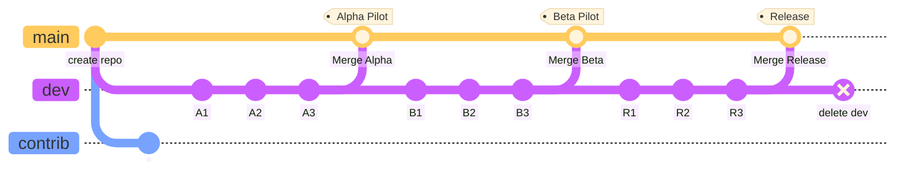

ACT-CMS Lesson Cookiecutter
===========================

This template repository is meant to streamline the lesson development process
with a default repository organization, branching structure, contribution
guidelines, development workflow instructions, and FAQs for ACT-CMS Faculty
Fellows.

## Repository Structure & Lesson Development Workflow

### Overview

### Tutorial Chapters

1. [The Big Picture](01_big-picture.md)
2. [Setup for ACT-CMS Fellows](02_fellow-setup.md)
3. Lesson development & authorship strategies
    * First draft of your lesson
    * Pedagogical Strategies & Lesson Versions
4. Committing your changes
5. The Alpha Pilot
    * ChemCompute deployment
    * LMS Integration
    * Assigning & Grading Student Work
6. Beta Development & Deployment
    * Learning from the alpha pilot
    * Identify a fellow to beta pilot your lesson
    * Beta a new version or a zhuzhed up alpha?
    * Distribution on the ACT-CMS Portal
7. Final Development & Deployment
    * Lesson Versions
    * Portal
    * PR to `act-cms/instructor-materials` etc.
8. Cohort 1: Abbreviated Contribution Flow

